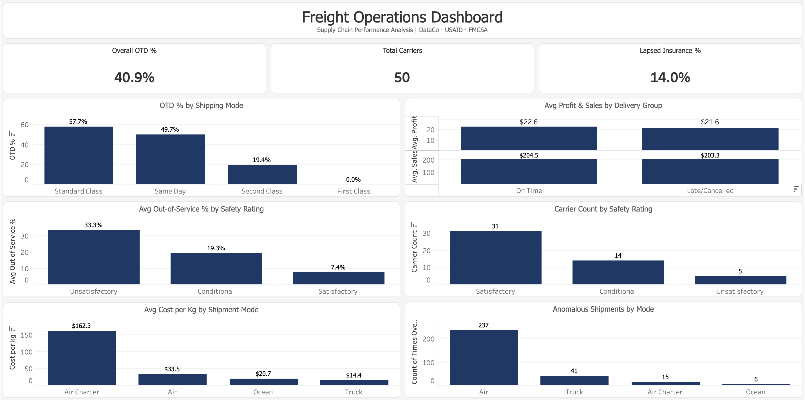

# freight-analytics
End-to-end freight operations analytics dashboard built with PostgreSQL, Excel, and Power BI — tracking OTD performance, carrier compliance, cost-per-mile, and freight bill accuracy across a simulated mid-size logistics operation.

# Freight Operations Analytics Dashboard

A portfolio project analyzing freight operations across three real-world datasets, targeting key business questions in delivery performance, cost management, and carrier compliance.

**Tools:** PostgreSQL · Microsoft Excel · Tableau Public

---

## Business Problems

| # | Dataset | Question |
|---|---------|----------|
| 1 | DataCo Supply Chain | Which shipping modes perform best on on-time delivery (OTD)? Does late delivery impact profitability? |
| 2 | USAID/SCMS Delivery History | What does freight cost per kg look like across shipment modes, and are there billing anomalies? |
| 3 | FMCSA Carrier Compliance | Which carriers have safety and compliance issues that pose operational risk? |

---

## Datasets

- **DataCo Supply Chain** — 180,000+ order records with delivery status, shipping mode, profit, and sales
- **USAID/SCMS Delivery History** — Pharmaceutical supply chain shipments with freight cost and weight data
- **FMCSA Carrier Compliance** — 50 carriers with safety ratings, inspection history, and insurance status

---

## Key Findings

### 1. Delivery Performance (DataCo)
- **Standard Class** has the highest OTD rate at **57.7%**; **First Class has 0% OTD** — every First Class order is late
- **Same Day** performs at 49.7% despite its name
- Delivery status has **minimal impact on profitability** — avg profit is $22.6 for on-time vs $21.6 for late/cancelled orders, suggesting late deliveries are not being penalized commercially

### 2. Freight Cost & Billing Anomalies (USAID)
- **Air Charter** is the most expensive mode at **$162.3/kg**, nearly 5x the cost of Air ($33.5/kg)
- **237 Air shipments** were flagged as anomalous (cost >2x the Air average per kg) — the largest count of any mode
- One extreme outlier: a 1kg Air shipment billed at **$19,480** (581x the mode average), likely a data error or emergency procurement

### 3. Carrier Safety & Compliance (FMCSA)
- **5 carriers** are rated Unsatisfactory, with an average out-of-service rate of **33.3%** — meaning 1 in 3 vehicles fails inspection
- **14.0% of carriers (7 out of 50)** have lapsed insurance
- All 7 lapsed-insurance carriers are also **overdue for inspection**, making them a double compliance risk

---

## Workflow

```
PostgreSQL (SQL Analysis)
        ↓
Microsoft Excel (Pivot Tables & Charts)
        ↓
Tableau Public (Interactive Dashboard)
```

### SQL Files
| File | Description |
|------|-------------|
| `01_delivery_performance.sql` | OTD by shipping mode, profit/sales by delivery group, late delivery risk analysis |
| `02_freight_cost_analysis.sql` | Avg cost per kg by shipment mode, billing anomaly detection (>2x mode average) |
| `03_carrier_compliance.sql` | Safety ratings, out-of-service rates, insurance status, days since last inspection |

---

## Dashboard

View the live dashboard on Tableau Public → https://public.tableau.com/app/profile/atharva.bhalilkar/vizzes



---

## Recommendations

1. **Audit First Class shipments** — 0% OTD warrants immediate investigation into whether this mode should continue to be offered
2. **Implement per-kg cost thresholds for Air invoices** — 237 anomalous shipments indicate weak cost controls; automated flagging before payment approval would reduce exposure
3. **Drop or remediate the 7 lapsed-insurance carriers** — they are simultaneously uninsured and overdue for inspection, creating significant liability risk
4. **Prioritize Unsatisfactory-rated carriers for review** — 33% avg out-of-service rate means a third of their fleet is non-operational at any given time

---

## Author

**Atharva Bhalilkar**  
[LinkedIn](https://www.linkedin.com/in/b-atharva/) · [Tableau Public](https://public.tableau.com/app/profile/atharva.bhalilkar/vizzes)
